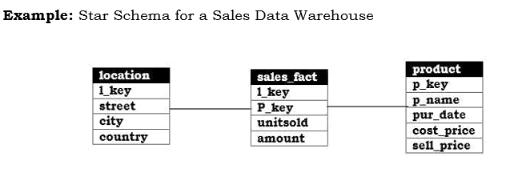

# Data Mining  
  
Data mining deals with the fetching of meaningful information (non-trivial, unknown, hidden, and implicit) or knowledge for huge amounts of data, which helps visualize and analyse the data for various commercial and scientific purposes.  
  
This process takes place after the data warehousing process, as it requires compiled or appropriate data to extract useful information.   
  
# Knowledge Discovery in Databases (KDD)
  
  
* <b>Data Cleaning</b>: Data cleaning step eliminates the inconsistencies and aberrations from the data. It standardizes and makes the data useable. Removal of noise or outliers. Collecting necessary information to model or account for noise.  
Strategies for handling missing data fields.  
  
*	<b>Data Integration</b>: This step of KDD is used to integrate or collaborate various databases of different types. The databases from various sources are integrated into a single database i.e. the different formats of data are standardized to a single form.  
  
*	<b>Data Selection and Transformation</b>: Finding useful features to represent the data depending on the goal of the task. Using dimensionality reduction or transformation methods to reduce the effective number of variables under consideration or to find invariant representations for the data.  
  
*	<b>Data Mining</b>: Searching for patterns of interest in a particular representational form or a set of such representations as classification rules or trees, regression, clustering, and so forth. Selecting method(s) to be used for searching for patterns in the data.  
  
*	<b>Pattern Evaluation</b> : The obtained patterns are then evaluated and analysed for interesting information and then stored in the database as given to user in the form of knowledge.  
  
# Star Schema
  
The star schema is perhaps the simplest data warehouse schema. It is called a star schema because the entity-relationship diagram of this schema resembles a star, with points radiating from a central table. The center of the star consists of a large fact table and the points of the star are the dimension tables.  
  
A star schema is characterized by one or more very large fact tables that contain the primary information in the data warehouse, and a number of much smaller dimension tables (or lookup tables), each of which contains information about the entries for a particular attribute in the fact table.  
  
A star query is a join between a fact table and a number of dimension tables. Each dimension table is joined to the fact table using a primary key to foreign key join, but the dimension tables are not joined to each other.  
  
The main advantages of star schemas are:  
  
1.	Provide a direct and intuitive mapping between the business entities being analyzed by end users and the schema design.  

2.	Provide highly optimized performance for typical star queries.  

3.	Are widely supported by a large number of business intelligence tools, which may anticipate or even require that the data-warehouse schema contain dimension tables.  
  
Star schemas are used for both simple data marts and very large data warehouse  
  

  
